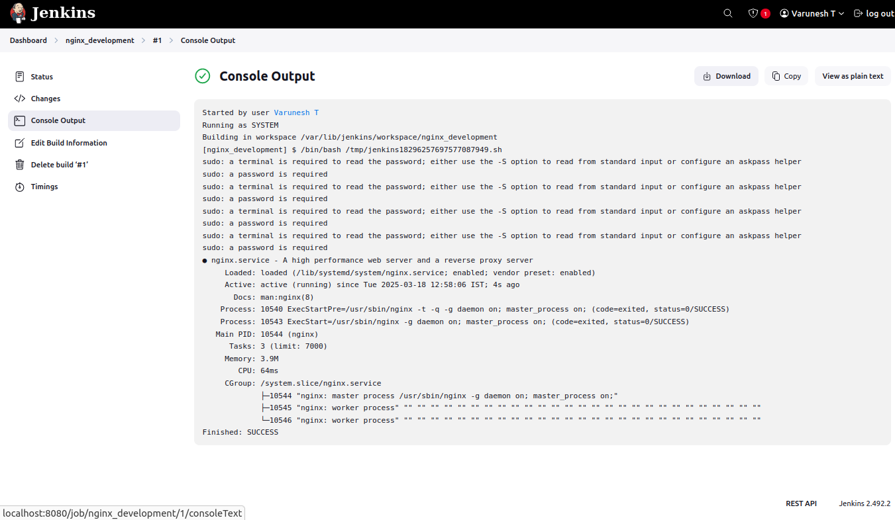

# Docker Image Creation and Jenkins Pipeline Setup

## Installing Docker
To install and verify Docker, execute the following commands:

```sh
sudo apt update
sudo apt install -y docker.io
sudo systemctl enable docker --now
docker
```


## Download Docker Plugins in Jenkins
Go to Jenkins Dashboard -> Manage Jenkins -> Available Plugins -> Search Docker. Select and install the following plugins:

- Docker
- Docker Commons
- Docker Pipeline
- docker-build-step
- CloudBees Docker Build and Publish

.png)
.png)

### Restart Jenkins
Check the "Restart Jenkins after installation" box. This will automatically restart Jenkins.

.png)
.png)

## Add Jenkins to Docker Group
To add Jenkins to the Docker group, run the following commands:

```sh
sudo usermod -aG docker jenkins
sudo systemctl restart jenkins
sudo reboot
```

## Setting Up Docker Credentials
Navigate to:

Jenkins -> Manage Jenkins -> Credentials -> System -> Global Credentials (Unrestricted) -> Add Credentials

Fill in your Docker Hub username and password. In the ID field, enter `docker-seccred`.

.png)

## Creating and Building a Jenkins Pipeline
1. Go to Jenkins Dashboard -> Create a Job
2. Enter a project name
3. Select Pipeline and click OK

.png)
.png)

### Pipeline Script
Paste the following pipeline script and update the credentials wherever mentioned:

```groovy
pipeline {
    agent any
    environment {
        IMAGE_NAME = "santhapriyan/docker"
        TAG = "latest"
        CONTAINER_NAME = "my-container"
        PORT = "3001"
    }
    stages {
        stage('Clone Repository') {
            steps {
                echo "Cloning GitHub repository..."
                git branch: 'main', url: 'https://github.com/santhapriyan-s/docker.git'
            }
        }
        stage('Build Docker Image') {
            steps {
                echo "Building Docker image..."
                sh 'chmod +x build.sh'
                sh './build.sh'
            }
        }
        stage('Login to Docker Hub') {
            steps {
                echo "Logging into Docker Hub..."
                withCredentials([usernamePassword(credentialsId: 'docker-hub-creds', usernameVariable: 'DOCKER_USER', passwordVariable: 'DOCKER_PASS')]) {
                    sh 'docker login -u $DOCKER_USER -p $DOCKER_PASS'
                }
            }
        }
        stage('Push Docker Image') {
            steps {
                echo "Pushing Docker image to Docker Hub..."
                sh "docker tag $IMAGE_NAME:$TAG $IMAGE_NAME:$TAG"
                sh "docker push $IMAGE_NAME:$TAG"
            }
        }
        stage('Deploy Docker Container') {
            steps {
                echo "Deploying Docker container..."
                sh 'chmod +x deploy.sh'
                sh './deploy.sh'
            }
        }
    }
    post {
        success {
            echo "Deployment Successful!"
        }
        failure {
            echo "Deployment Failed!"
        }
    }
}
```

### Build and Deploy
1. Click **Save**.
2. Click **Build**.



### Access the Application
Visit `localhost:3001` to access the deployed application.

