# Installing Jenkins in Linux and Creating a Freestyle Nginx Project

This guide covers the installation of Jenkins on a Linux system and the creation of a freestyle project to deploy Nginx.

## Prerequisites
Ensure your system is updated before proceeding:
```bash
sudo apt update && sudo apt upgrade -y
```

## Installing JDK 17
Jenkins requires Java to run. Install OpenJDK 17:
```bash
sudo apt install -y openjdk-17-jdk
sudo update-alternatives --config java
```

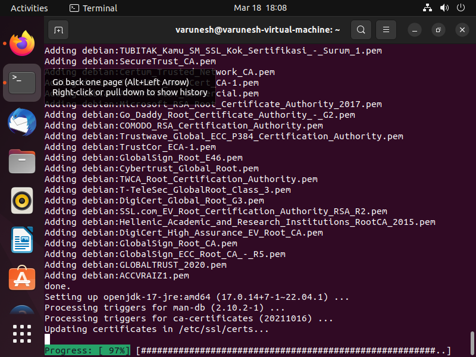

- After installation, select the appropriate Java version (`java-17`).

## Installing Jenkins
Download and install Jenkins from the official repository:
```bash
sudo wget -O /usr/share/keyrings/jenkins-keyring.asc \
  https://pkg.jenkins.io/debian-stable/jenkins.io-2023.key

echo "deb [signed-by=/usr/share/keyrings/jenkins-keyring.asc]" \
  https://pkg.jenkins.io/debian-stable binary/ | sudo tee \
  /etc/apt/sources.list.d/jenkins.list > /dev/null

sudo apt-get update
sudo apt-get install jenkins
```

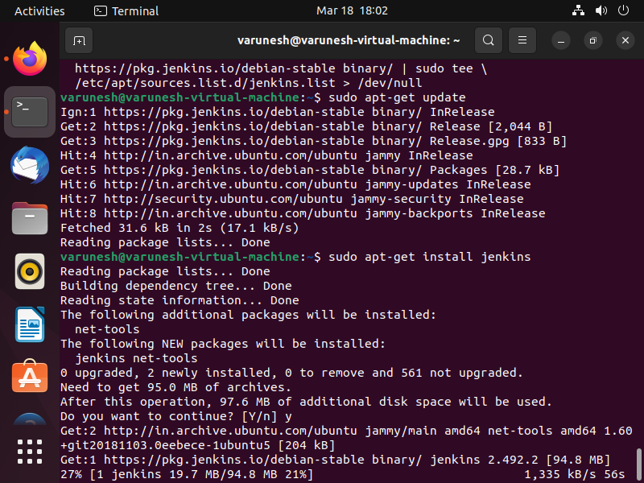

## Starting and Enabling Jenkins
Start Jenkins and enable it to run on system boot:
```bash
sudo systemctl enable jenkins
sudo systemctl start jenkins
sudo systemctl status jenkins
```
- Copy the password provided in the output for the next step.

## Jenkins Initial Setup
1. Open a browser and navigate to `http://localhost:8080`.
2. Enter the initial password from the previous step.

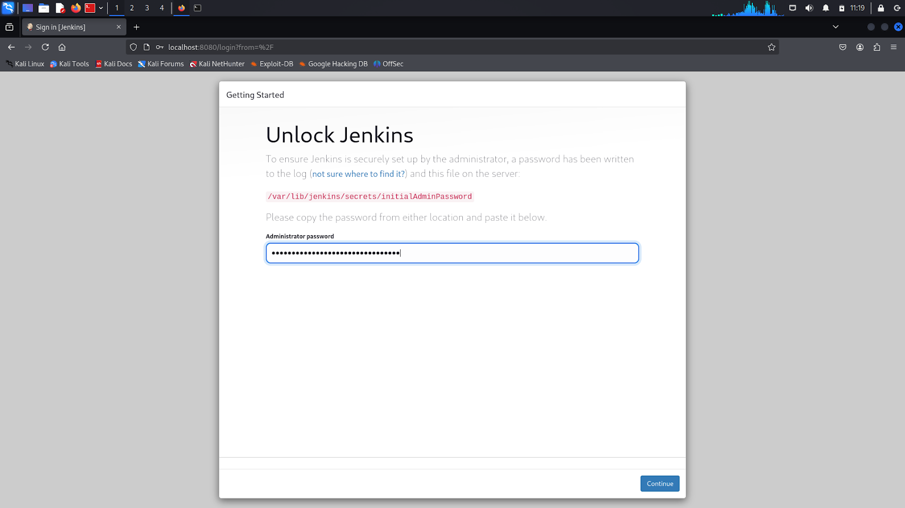

3. Click `Continue`.

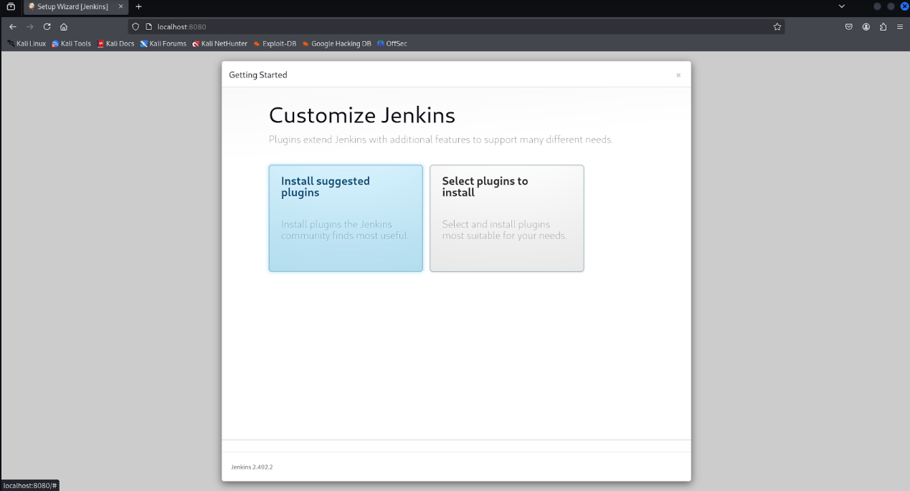

4. Click `Install Suggested Plugins`.

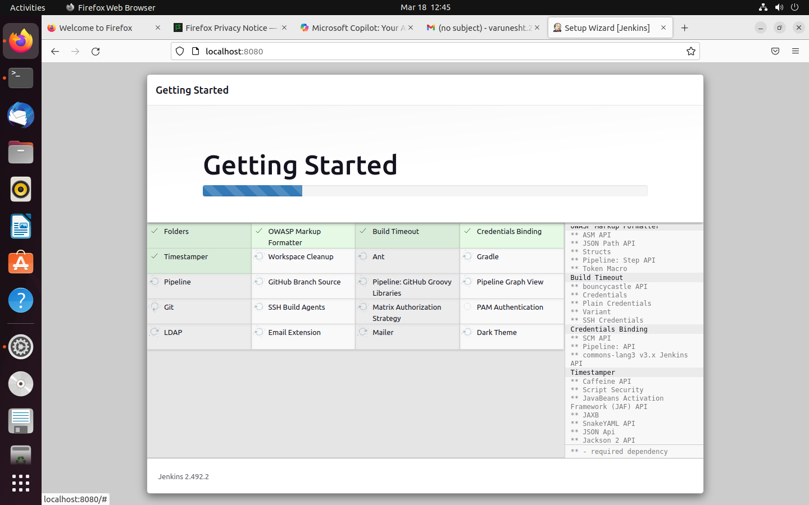

5. Wait for the plugin installation to complete, then click `Start Jenkins`.

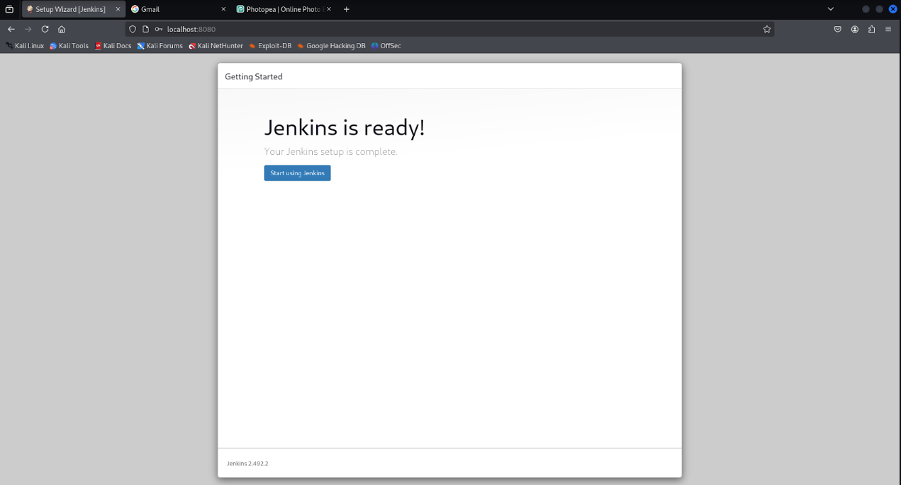

6. Create an admin user with a username and password.

> **Note:** This username and password will be required for future logins.

7. Click `Save and Continue`.

8. Keep the default Jenkins URL and click `Save and Finish`.

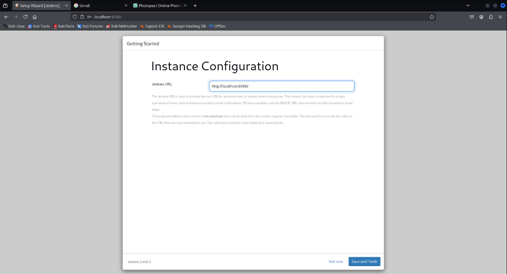

## Creating an Nginx Freestyle Project in Jenkins
1. Click `Create a Job` from the Jenkins homepage.

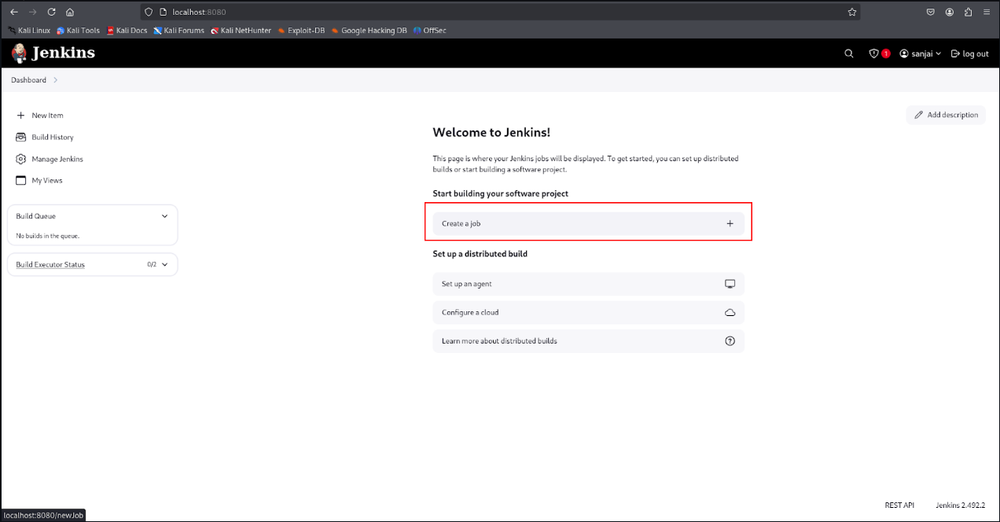

2. Enter a project name.
3. Select `Freestyle Project`.
4. Click `OK`.

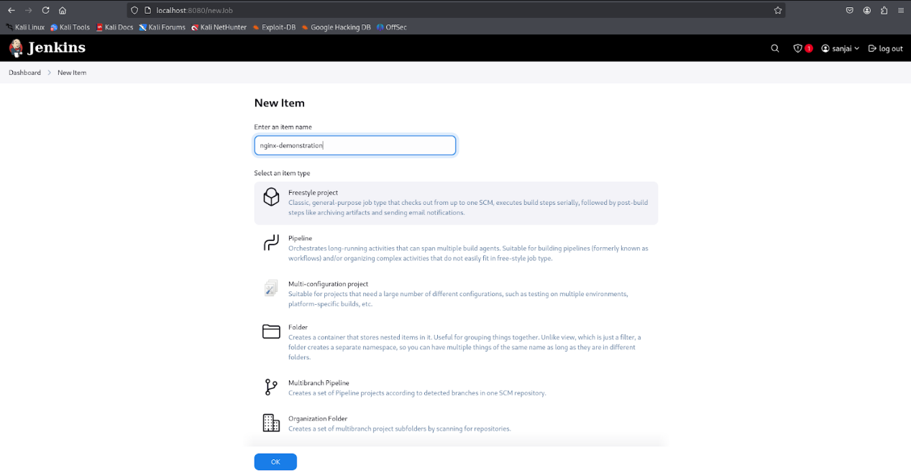

5. Scroll to `Build Steps`.
6. Click `Add Build Step` → `Execute Shell`.

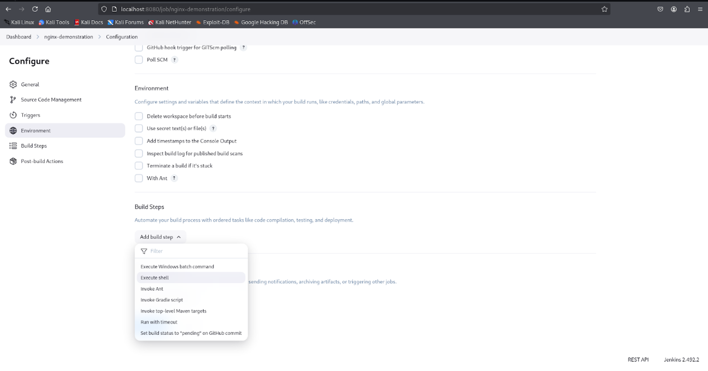

7. Add the following shell script to install and configure Nginx:
```bash
#!/bin/bash
# Update package lists
sudo apt update -y

# Install Nginx
sudo apt install -y nginx

# Start and enable Nginx
sudo systemctl enable nginx.service
sudo systemctl start nginx

# Verify Nginx is running
systemctl status nginx
```

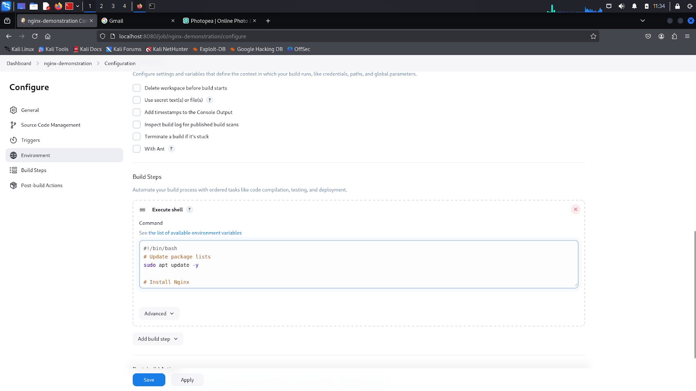

8. Click `Build Now` on the left panel.

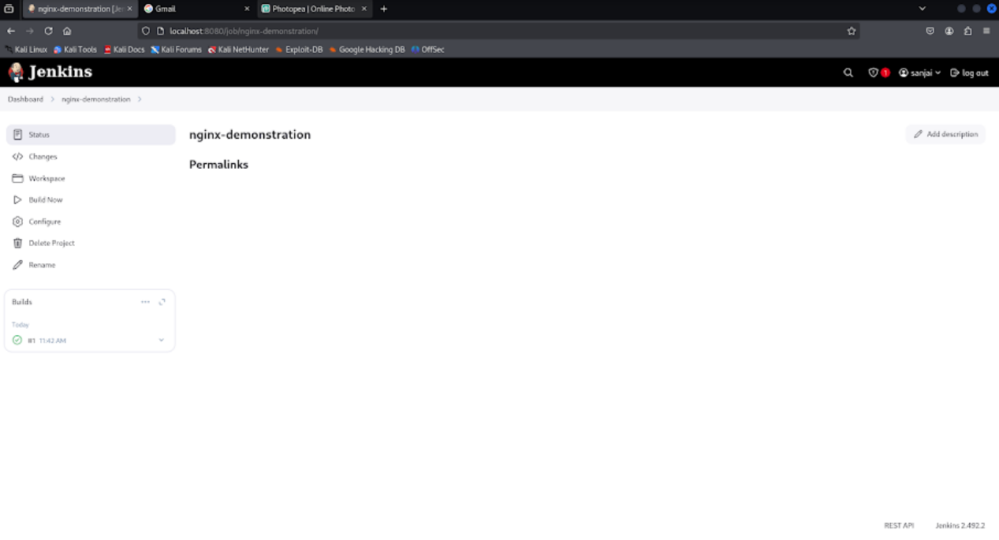

## Verifying the Deployment
- Once the build is complete, click on the build entry under `Builds`.
- Click `Console Output` to review logs and confirm successful installation.

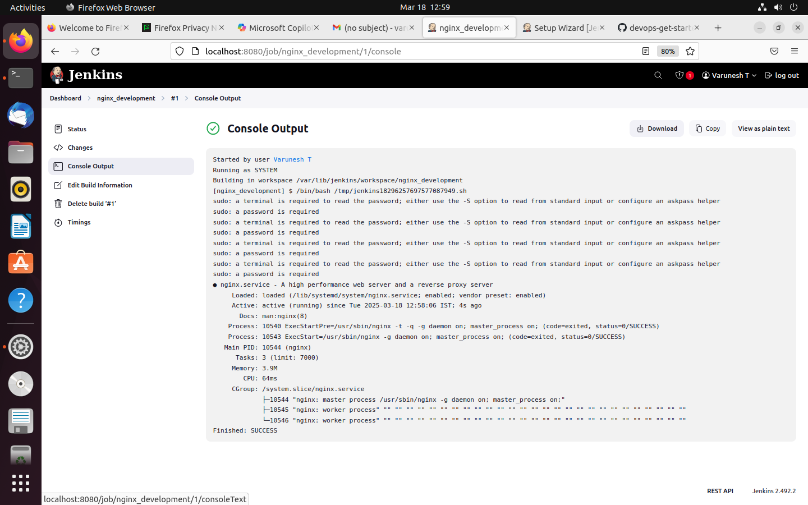

Congratulations! You have successfully installed Jenkins and deployed Nginx using a freestyle project. Push this documentation to your Git repository for future reference.

